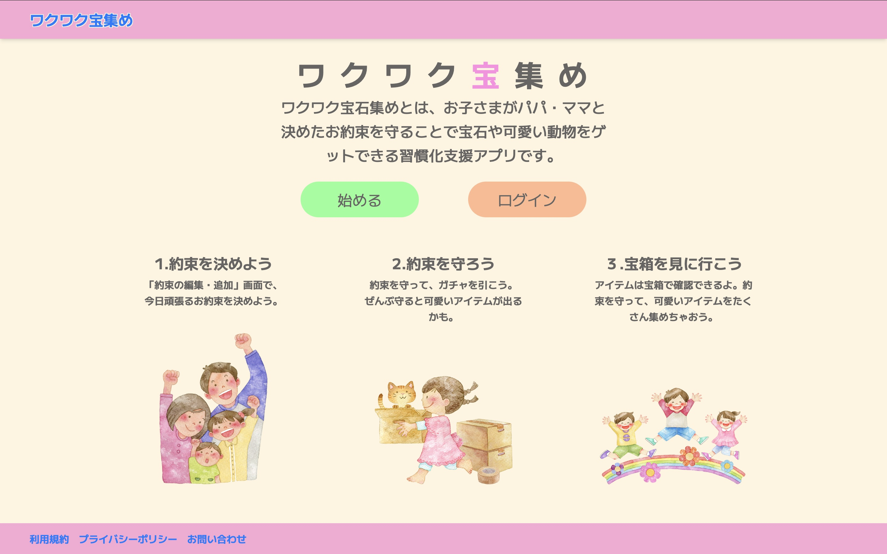
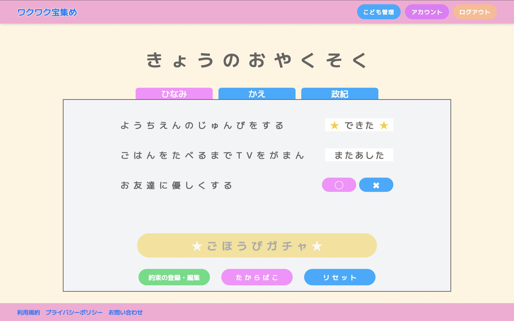
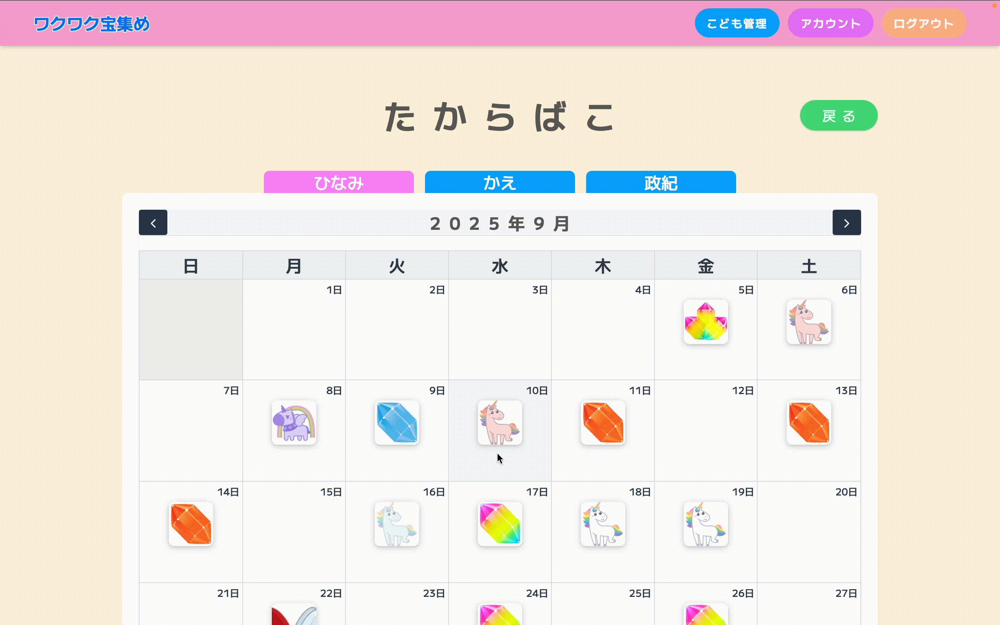
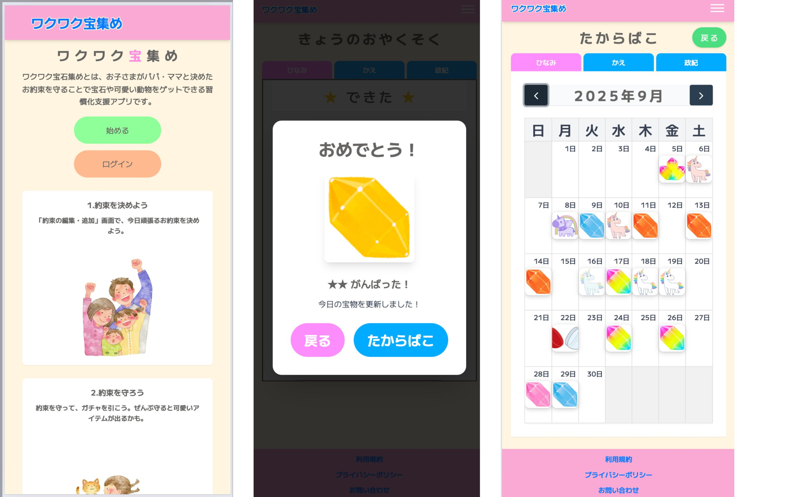
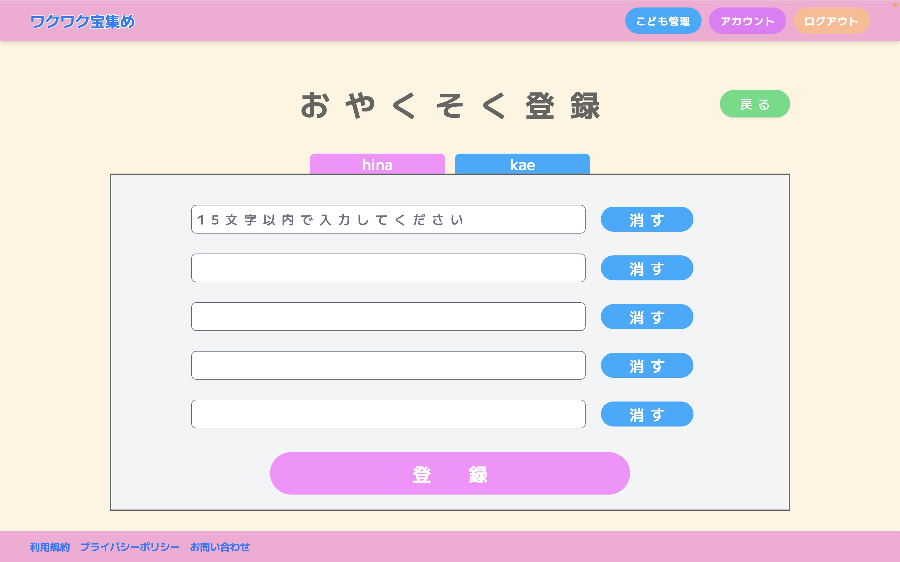
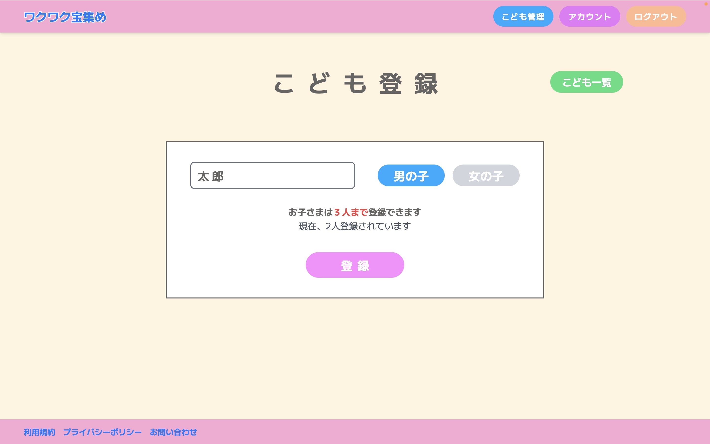
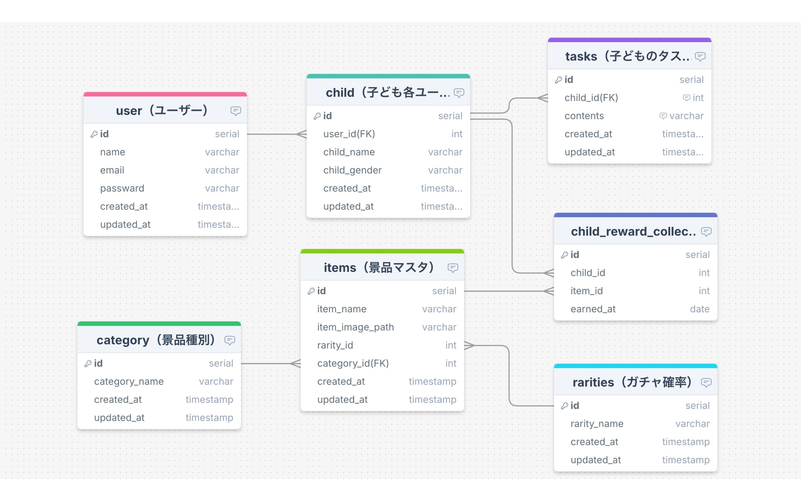

# ワクワク宝集め / 親子向けタスク管理サービス

ワクワク宝集めは、「子どもの日々の約束（タスク）達成を楽しくサポートする」という想いから作られた、親子向けタスク管理 Web アプリケーションです。

パパ・ママと決めた約束（タスク）を達成するとガチャを引いて、ご褒美の宝石をゲットできます。また、ゲットしたアイテムは宝箱で確認することができます。

子どもイヤイヤ期に、毎日の歯磨きやお片付け、着替えといった基本的な生活習慣をつけるのに苦労した経験から、「親子で楽しく習慣づけるサービスがあったらいいな」と思った経験から生まれています。**約束を守る → ガチャを引く → 宝石を集める**にするというステップを通じて、お子さまが生活習慣を楽しく身につけることをサポートします。

※ 本アプリケーションは、スマートフォンおよび PC に対応したレスポンシブデザインを採用しています。

---

## スクリーンショット

### トップページ

### 約束（タスク）確認

### ご褒美ガチャ

### たからばこ（獲得アイテム参照）

### レスポンシブデザイン

## 主な機能

### ① 　タスク（約束）管理機能

登録した約束を確認して、達成できたか判定できます。

### ② 　タスク（約束）登録・編集機能

新規登録では約束を最大５個まで一括登録できます。

### ③ 　ガチャ機能

約束達成でガチャ実行できます。ガチャで抽選されるアイテムは約束の達成度で変わります。

### ④ 　獲得アイテム確認機能

カレンダーで獲得アイテムを表示。モーダル画面で拡大表示できます。

### ⑤ 　子ども登録・編集機能（最大 3 人）

最大３人まで子供を登録できます。登録した子どもの名前が ①〜④ のタブに反映され、表示を切り替えることができます。

## URL

https://daily-treasure-card.fly.dev/

### テストアカウント（デプロイ後利用可能）

-   メールアドレス: `test@example.com`
-   パスワード: `password`

## 使用技術

### バックエンド

-   PHP 8.4
-   Laravel 12
-   Livewire 3.6
-   Composer

### フロントエンド

-   HTML5/CSS3
-   Tailwind CSS 3
-   JavaScript（ES6+）
-   Vite 5
-   Axios（HTTP 通信）
-   FullCalendar.js（カレンダー表示）
-   Node.js/npm

### データベース

-   PostgreSQL

### 開発環境・インフラ

-   Docker
-   Git/GitHub

### デプロイ
-   Fly.io

【注意事項】

・無料枠を使用しているため、一定時間アクセスがないとアプリやDBが自動でスリープします

・初回アクセス時は、起動に少し時間がかかる場合があります（エラーが出ても再読み込みで復帰します）

---

## 📊 ER 図

---

## 🔄 今後の予定

ガチャで獲得できる景品やレアリティをユーザーごとに編集できる「ガチャ編集機能」を実装する予定です。
